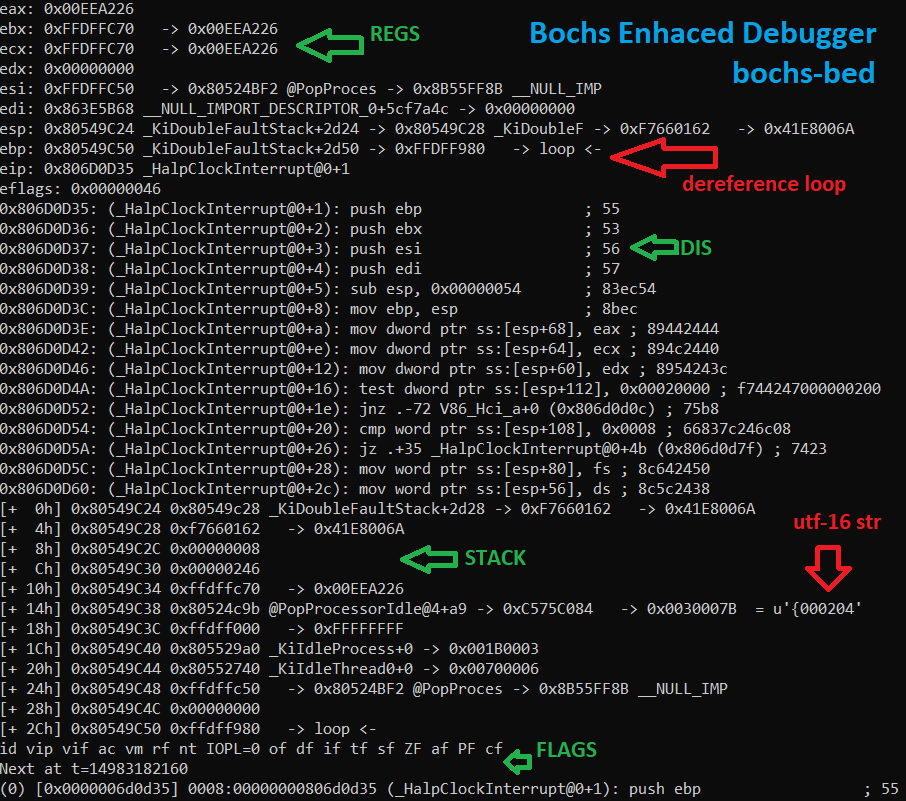
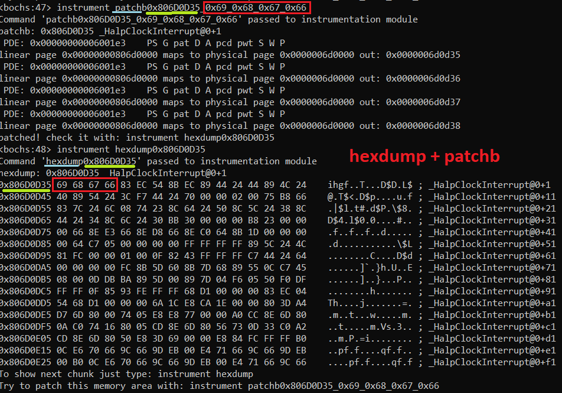
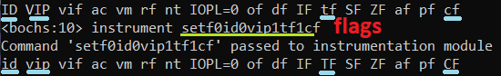
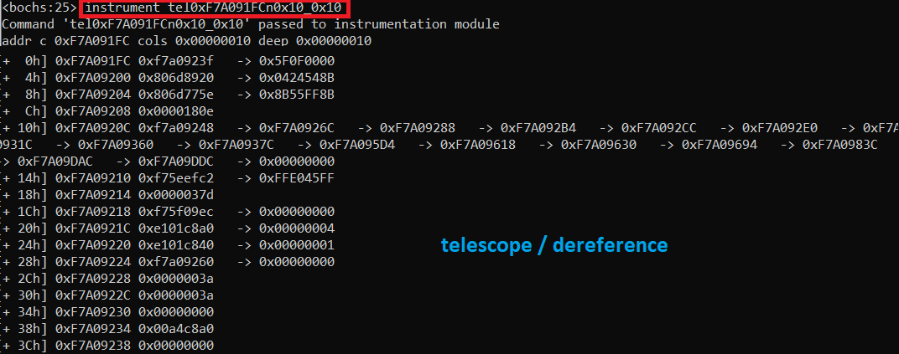
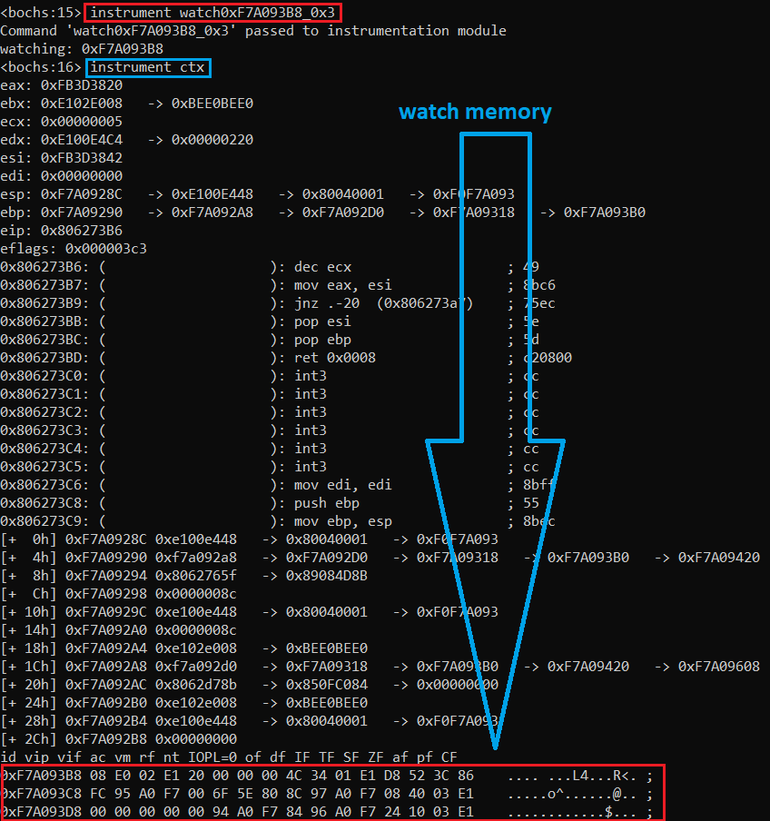

# Bochs Enhaced Debugger (bochs-bed)

 A modern console debug experience for Bochs 



**WARNING:** its just a POC yet (alpha version)

Btw, the code is crap and only works with boch_x64 + 32 bits OS like Linux or Windows

# patch memory & hexdump



# flags manipulation



# telescope / dereference



# watch memory



# help

```
help: instrument phelp
show context: instrument ctx
hexdump: instrument hexdump<0xADDR> Ex: instrument hexdump0xF737CAE4
hexdump next chunk: instrument hexdump
patch memory: instrument patchb<0xADDR>_<0xBYTE1_0xBYTE2...> Ex: instrument patchb0xF737CAE4_0x69_0x68_0x67_0x66
set/unset flags: instrument setf<1|0Flag...> Ex: (ID = 1, IOPL = 0, TF = 1) instrument setf1id0iopl1tf
disassemble: instrument dis<0xADDR> Ex: instrument dis0x80537F58
disassemble next chunk: instrument disassemble
watch memory: instrument watch<0xADDR>[_0xNR-LINES] Ex: instrument watch0x80537F58_0x3
remove watch memory: instrument watch0
dereference/telescope: instrument tel<0xADDR><n0xNR-COLS><_0xDEPTH> Ex: instrument tel0xF737CAE8n0x3_0x5
remove layout: instrument layout
add layout: instrument layout<asm|stack|regs> Ex: instrument layoutstackasmregs
convert address to symbol: instrument hexdump<0xADDR>
```

# Related

- https://github.com/therealdreg/ida_bochs_windows
- https://github.com/therealdreg/pdbdump_bochs

# credits

- inspired by GDB-GEF https://github.com/hugsy/gef
- https://github.com/stlintel/Bochs
- https://bochs.sourceforge.io/
